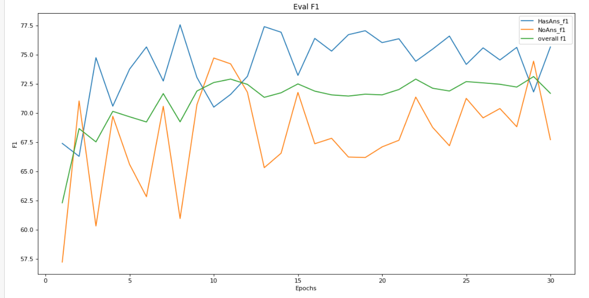
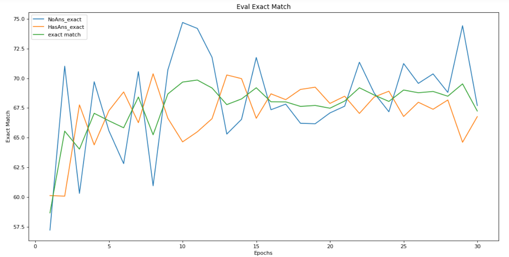

# Machine Comprehension- Question Answering System

## Background 
Humans have been writing things for thousands of years either for themselves or someone else to later have access to that information. Troves of historical information available and with the advent of the internet the volume of information has only increased but you have to read it and understand it to possibly benefit from it 
Very common task to look in a passage for the answer to a particular question.
Often to find out that the answer is not in the passage

## Problem Statement 

Problem: A law firm is looking to deploy a question answering system for employees to speed up research and fact verification . If a effective solution can be implemented it will help reduce costs and increase efficiency.   
Current Solution: Find sources of information and read each source until you find the answer. 
Proposed Solution: Train and deploy a machine learning model that users can interactive with on the web. Model takes input of  text passage and question from the user and returns the answer to the question if possible.

##  The Data

- Questions on random sample of 500 articles out of top 10,000 wikipedia articles
- Answer to every question is a segment of text from the corresponding passage, or the question might be unanswerable.
- V1 (2016) 
    - 107,785 question-answer pairs on 536 articles.
    - 80/10/10 split for train/dev/test 
- V2 (2018) 
- 53,775 unanswerable questions written to look similar to answerable ones added to V1

## Metrics 

- Exact Match: the percentage of predictions that match any one of the ground truth answers exactly.
- F1: average overlap between the prediction and ground truth answer
    - treat the prediction and ground truth as bags of tokens, and compute their F1 
    - take the maximum F1 over all of the ground truth answers for a given question
    - then average over all of the questions. 
- Human F1 89% on SQuAD 2.0
- Current leading model F1 93.214% IE-Net (ensemble)

## Workflow 

1. Pick transformer model pre-trained on different on NLP task
2. Preprocess SQuAD for use with pretrained model 
3. Fine tune model on training dataset 
4. Evaluate fine tuned model on dev set 
5. Create application using fine tuned model for inference 
6. Deploy application so anyone may use it 

## Data Preparation 

1. Encode question-context pairs with truncation, padding, and keeping overflows using a stride 
2. Input ids and  attention mask (features for model)  
3. Map features to corresponding example 
4. Go through all spans of question,context  pairs 
5. Get start and end character index of answer within context 
6. Get start and end token of answer  (labels for model) 

## Training 

- HuggingFace model  “google/electra-small-discriminator”  with ~14 million parameters 
- Trained for 65 epochs  @ 30 min/ epoch on GPU = 32.5 hours trained 
- HuggingFace Trainer class and PyTorch to train model on SQuAD 
- Did not evaluate model (F1 / EM) during training to reduce computing cost 
- Model Input:  input ids, attention mask 
- Model Output: loss, start logits, end logits 

## Evaluate Model 

Dev set: 5928 answerable questions and  5945 unanswerable questions   
1. Same steps as data preparation to encode examples for input to model 
2. Instantiate trainer from saved checkpoint of model and generate predictions 
3. Using start logits and end logits find top 10 likely start/end indices 
4. Try all possible combinations of top start/end indices checking if they are valid and score them (start + end logit) 
5. Combination with highest score is used as final prediction for comparison to ground truth values 
6. Compute metrics 

## Model Results 

## Demo Web App to Deploy Model 
- Streamlit for front end of application (user input/ answer output)  [Repo](https://github.com/watsupdoc67/qa_model_app)
- Load trained model 
- Create pipeline to process and make inference for any question, context pair 
- Run inference on trained model and post process to get predicted answer text 
- Return result to user 
- Hosted on AWS EC2 instance 
- Deep Learning AMI (Amazon Linux 2) Version 50.0
    - t2.micro : 1 vCPU, 1 Gb ram 
    -  http://3.138.193.164:8501 

## Next Steps 

- Add more functionality to application such as uploading files to analyze
- Add more layers to neural network or use bigger base model (electra large) 
- Train for more epochs 
- Adjust model response to unanswerable question 
- Train model on additional question answer datasets to make it more robust 

## Sources 

https://arxiv.org/pdf/1606.05250.pdf    SQuAD: 100,000+ Questions for Machine Comprehension of Text Pranav Rajpurkar and Jian Zhang and Konstantin Lopyrev and Percy Liang 2016
https://arxiv.org/abs/1806.03822 Know What You Don’t Know: Unanswerable Questions for SQuAD  Pranav Rajpurkar,  Robin Jia, Percy Liang 2018 
https://arxiv.org/pdf/2003.10555.pdf 
https://www.humanfactors.com/newsletters/human_interaction_speeds.asp
https://rajpurkar.github.io/SQuAD-explorer/ 
